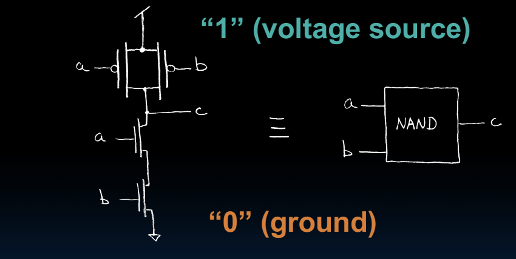

## classify

callee saved用处:整个函数都要用

举例

如果使用caller saved，那么下面的t0需要保存很多次(在每次call一个函数时候都要保存)

```
li t0, 100 # 要用t0
# 需要保存t0
call func1
# 恢复t0
li t0, 101 # 要用t0
# 需要保存t0
call func2
# 恢复t0
```

而如果使用callee saved，则只需要保存一次(func1和func2不用s0前提下)

如果func1和func2不用s0，只需保存一次

```
li s0, 100
# 保存s0
call func1
call func2
# 恢复s0
```

## logisim
assert表示关掉

半导体是一个极控制两端是否导电，可以用作放大器和开关

drain是目的地，source是源，gate是门



上图中当A和B均高，则输出接到下面的地，反之下面的不通，到上面的高电平是并联，有一个通则通

## rvcpu

电路思考方式:在cs61c cpu中，只有寄存器是按照clk来变动的，其他都是组合逻辑，没有时序逻辑

所以每个时钟节拍，是每个寄存器根据输入，传到到输出，然后改变组合逻辑，进而再改变寄存器输入，等下个节拍再重复的过程

模拟cpu运行过程:时钟到来->所有寄存器输出**同时**改变，输出值仅取决于上周期稳定后的输入->数字电路改变->寄存器输入改变->时钟到来->寄存器换成新的输入....

时钟作用:使寄存器不要乱变(不稳定的时候变)

寄存器在流水线处理器有隔离各阶段值的作用

在流水线版本的cpu，nextpc/nextinstr是本时间第一阶段的输出，作为下个时间第二阶段的输入

当遇到要跳转的时候(PCSel变了)的动作(以跳转指令执行的周期稳定后开始算):

- 需要把进入中转指令寄存器输入(下阶段指令)换成noop(0x13),此时NextPC虽然是错的，但由于指令是noop所以没事
- 反馈的PCSel到了IF部分的输入，此时PC寄存器的输入是跳转到的指令

- 下一时钟到来
- IF部分的PC是输出跳转到指令，执行部分的中转指令输出是noop，中转的pc输出是错误pc
- 执行数字逻辑
- 稳定后IF部分的PC是输入跳转到的指令的下一条，执行部分的中转指令输入是跳转到的指令，中转的pc是输入跳转到pc
- 则下一时钟执行部分执行的就是跳转到的指令

第一个时钟的时候执行模块没有取指模块来的数据，所以此时执行的是寄存器的默认值